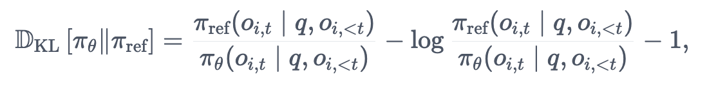

# Video GRPO Tutorial

# Training Vision Language Models with GRPO for Visual Grounding

Based on the recent advances in RL for reasoning enhance, we'll explore how to fine-tune Video Language Models (Video-LLMs) using ***Group Relative Policy Optimization*** (***GRPO***). We'll walk through a complete training pipeline, from dataset preparation to evaluating results.

## 1. Modified GRPO for Video Language Models

### Adapting GRPO for Video Language Models

Based on the our previous tutorial [Vision-GRPO](https://github.com/FusionBrainLab/Vision_GRPO) and great work from aurthors of [Video-R1](https://arxiv.org/abs/2503.21776), we provided the simplified version of the approach for **training video language models to understand time**. To adapt it for Video Language Models, we need to:

1. **Handle Video Inputs**: Process both video and images in the same time as it is a crucial aspect for training;
2. **Custom Reward Functions**: Create video-specific rewards that evaluate how well the model preserve temporal ordering in video;
3. **Specialized Architecture**: Use a vision-language model architecture (like Qwen2.5-VL) that can process both modalities

Due to the fact that each Video-Language model follows its own architecture, we are not able to use unified abstraction such as AutoModelforCausalLM for language models, so, our tutorial covers two common multimodal architectures for Qwen-VL (2 and 2.5).


In this tutorial you will:

- Learn about GRPO & Reward Functions (also video-specific)
- Configure desired settings with `open-r1` project
- Understand how to process video/text and image/text pairs
- Train your midel to upgrade video reasoning capabilities

## 2. How GRPO Trains a Model

In few words: **GRPO** is an online learning algorithm, meaning it improves iteratively by using the data generated by the trained model itself during training. The intuition behind GRPO objective is to maximize the advantage of the generated completions, while ensuring that the model remains close to the reference policy. To understand how GRPO works, it can be broken down into four main steps: , computing the advantage, estimating the KL divergence, and computing the loss.

1. **Generating completions**: At each training step, we sample a batch of prompts and generate a set of $G$ completions for each prompt (denoted as $o_i$).
2. **Computing the advantage**: For each of the $G$ sequences, we compute the reward using a reward model. To align with the comparative nature of reward models—typically trained on datasets of comparisons between outputs for the same question—the advantage is calculated to reflect these relative comparisons. It is normalized as follows: 

$$
\hat{A}_{i,t} = \frac{r_i - \text{mean}(\mathbf{r})}{\text{std}(\mathbf{r})}
$$

3. **Estimating the KL divergence**: KL divergence is estimated using the approximator introduced by [Schulman et al. (2020)](http://joschu.net/blog/kl-approx.html). The approximator is defined as follows: 
<div style="text-align:center">

</div>
<!-- $$
\mathbb{D}_{\text{KL}}\left[\pi_\theta \|\pi_{\text{ref}}\right] = \frac{\pi_{\text{ref}}(o_{i,t} \mid q, o_{i,<t})}{\pi_\theta(o_{i,t} \mid q, o_{i,<t})} - \log \frac{\pi_{\text{ref}}(o_{i,t} \mid q, o_{i,<t})}{\pi_\theta(o_{i,t} \mid q, o_{i,<t})} - 1, 
$$ -->
4. **Computing the loss**: The objective is to maximize the advantage while ensuring that the model remains close to the reference policy. Consequently, the loss is defined as follows: 
<div style="text-align:center">

</div>
<!-- $$
 \mathcal{L}_{\text{GRPO}}(\theta) = -\frac{1}{\sum_{i=1}^G |o_i|} \sum_{i=1}^G \sum_{t=1}^{|o_i|} \left[ \frac{\pi_\theta(o_{i,t} \mid q, o_{i,< t})}{\left[\pi_\theta(o_{i,t} \mid q, o_{i,< t})\right]_{\text{no grad}}} \hat{A}_{i,t} - \beta \mathbb{D}_{\text{KL}}\left[\pi_\theta \| \pi_{\text{ref}}\right] \right], 
$$ -->
where the first term represents the scaled advantage and the second term penalizes deviations from the reference policy through KL divergence.

## 3. GRPO with Video-LLMs

<div style="text-align:center">

</div>
<div style="text-align:center">Reasoning paths of GRPO vs. T-GRPO. Without explicit temporal modeling, models may learn sub-optimal video reasoning patterns by taking shortcuts, therefore failing to generalize well.</div>

 Recent work has demonstrated the great potential of applying GRPO to multimodal models. However, their application to video involves two fundamental challenges: 
 
 1. First, original GRPO **lacks explicit reward signals for encouraging temporal reasoning in a video**. Without explicit temporal awareness, the model may take shortcuts for reasoning, focusing on a single frame or snapshot rather than reasoning over time. The underexploitation for temporal cues can cause the learned reasoning strategies to "shortcut" the process—relying on superficial visual patterns, rather than engaging in deeper and temporally grounded reasoning. This could ultimately hindering generalization to more complex or diverse video reasoning tasks.

2. The second issue lies in **the scarcity of high-quality video reasoning training data**, especially samples that demand strong reasoning ability or involve long reasoning path. Most existing video training datasets mainly focus on simple recognition tasks, rather than reasoning. This scarcity makes it difficult to expose the model to diverse, challenging reasoning patterns during training, limiting the effectiveness of RL and hindering the emergence of robust reasoning behaviors.

To address these challenges, [Video-R1](https://arxiv.org/pdf/2503.21776) paper proposed two key solutions
- T-GRPO, an extension of the original GRPO algorithm that explicitly encourages temporal reasoning.
- constructed two video/image datasets: Video-R1-CoT-165k for SFT cold start and Video-R1-260k for RL training.

## 4. 📐 Set up environment.

```bash
# build environment
conda create -n video-r1 python=3.11 
conda activate video-r1
conda install -c "nvidia/label/cuda-12.4.0" cuda-toolkit -y
pip install torch==2.5.1 torchvision==0.20.1 torchaudio==2.5.1 --index-url https://download.pytorch.org/whl/cu124

# Addtional modules
pip install wandb==0.18.3
pip install tensorboardx
pip install flash-attn --no-build-isolation

# qwen video extraction setting, e.g., max frames, resolutions
# Use the [decord] feature to improve speed
cd src/qwen-vl-utils
pip install -e .[decord]
cd ..

# Then install our provided version of transformers
cd ./transformers-main
pip install .
```

For vLLM library, please use 0.7.2 version.

For trl library, please use 0.16.0 version.

## 5. Dataset

`Video-R1-CoT-165k` and `Video-R1-260k` were collected from a variety of public datasets and carefully sample and balance the proportion of each subset.

To facilitate an effective SFT cold start, authors leveraged Qwen2.5-VL-72B to generate COT rationales for the samples in Video-R1-260k. After applying basic rule-based filtering to remove low-quality or inconsistent outputs, we obtain a high-quality CoT dataset, Video-R1-COT 165k.

<div style="text-align:center">

</div>

### Dataset Structure

For this tutorial we will take only small part of this data - as an example. We will work with videos and tasks taken from [NExT-QA](https://arxiv.org/abs/2105.08276) dataset. NExT-QA is a VideoQA benchmark targeting the explanation of video contents. It challenges QA models to reason about the causal and temporal actions and understand the rich object interactions in daily activities. 

It contains about 2.5k. samples and ~1.3k. unique videos files with duration up to 30 seconds. 

<div style="text-align:center">

</div>
<div style="text-align:center">A few examples from dataset.</div>

### Prompts for Training

First of all, we take a text + video sample and format it in the chat template required by our model (by default we use Qwen2.5-VL 7b). 

- We use a **system message**, that introduces a `format` of generated answer.
```python
SYSTEM_PROMPT = "A conversation between User and Assistant. The user asks a question, and the Assistant solves it. The assistant first thinks about the reasoning process in the mind and then provides the user with the answer. The reasoning process and answer are enclosed within <think> </think> and <answer> </answer> tags, respectively, i.e., <think> reasoning process here </think><answer> answer here </answer>"
```

- Special **question template** with placeholder for `question`.
```python
QUESTION_TEMPLATE = "{Question}
Please think about this question as if you were a human pondering deeply. Engage in an internal dialogue using expressions such as 'let me think', 'wait', 'Hmm', 'oh, I see', 'let's break it down', etc, or other natural language thought expressions It's encouraged to include self-reflection or verification in the reasoning process. Provide your detailed reasoning between the <think> </think> tags, and then give your final answer between the <answer> </answer> tags. "
```

- For each task we introduce **task type prompts**.
```python
TYPE_TEMPLATE = {
    "multiple choice": " Please provide only the single option letter (e.g., A, B, C, D, etc.) within the <answer> </answer> tags.",
    "numerical": " Please provide the numerical value (e.g., 42 or 3.14) within the <answer> </answer> tags.",
    "OCR": " Please transcribe text from the image/video clearly and provide your text answer within the <answer> </answer> tags.",
    "free-form": " Please provide your text answer within the <answer> </answer> tags.",
    "regression": " Please provide the numerical value (e.g., 42 or 3.14) within the <answer> </answer> tags."
}
```

Formatting whole prompt looks very simple for videos:
```python
    
def make_conversation_video(example):
    return {
        "prompt": [
            {
                "role": "user",
                "content": [
                    {"type": "video"},
                    {"type": "text", "text": QUESTION_TEMPLATE.format(Question=example["problem"])},
                ],
            },
        ],
}
```


## 6. Training

### Setting Up Reward Functions

A key component of GRPO is the definition of reward functions. For video reasoning, we define multiple reward functions to evaluate different aspects of the model's output.

1. **Accuracy** adapted for different types of input data.
```python
def accuracy_reward(completions, solution, **kwargs):
    
    def extract_answer(text):
        pattern = r'<answer>\s*(.*?)\s*</answer>'
        match = re.search(pattern, text, re.DOTALL)
        if match:
            return match.group(1).strip()
        return ""

    def normalize_number(num_str):
        try:
            num_str = num_str.replace(',', '')
            return float(num_str)
        except Exception as e:
            print(f"Error converting '{num_str}' to float: {e}")
            return None

    def wer(reference, hypothesis):
        ref_words = reference.split()
        hyp_words = hypothesis.split()
        m = len(ref_words)
        n = len(hyp_words)
        d = [[0]*(n+1) for _ in range(m+1)]
        for i in range(m+1):
            d[i][0] = i
        for j in range(n+1):
            d[0][j] = j
        for i in range(1, m+1):
            for j in range(1, n+1):
                if ref_words[i-1] == hyp_words[j-1]:
                    d[i][j] = d[i-1][j-1]
                else:
                    d[i][j] = 1 + min(d[i-1][j], d[i][j-1], d[i-1][j-1])
        return d[m][n] / max(1, m)


    def compute_rouge_score(reference, hypothesis, use_stemmer=True):
        scorer = rouge_scorer.RougeScorer(['rouge1', 'rouge2', 'rougeL'], use_stemmer=use_stemmer)
        scores = scorer.score(reference, hypothesis)
        average_fmeasure = (scores['rouge1'].fmeasure + scores['rouge2'].fmeasure + scores['rougeL'].fmeasure) / 3
        return average_fmeasure
    

    question_type = kwargs['problem_type'][0]
    
    contents = [completion[0]["content"] for completion in completions]
    current_time = datetime.now().strftime("%d-%H-%M-%S-%f")
    rewards = []

    for content, sol in zip(contents, solution):
    
        try:
            output_ans = extract_answer(content)
            gt_ans = extract_answer(sol)
            if question_type == "multiple choice":
                reward = 1.0 if output_ans.strip() == gt_ans.strip() else 0.0
            elif question_type == "numerical":
                gt_has_decimal = ("." in gt_ans) or ("," in gt_ans)
                out_has_decimal = ("." in output_ans) or ("," in output_ans)
                if gt_has_decimal != out_has_decimal:
                    reward = 0.0
                else:
                    gt_number = normalize_number(gt_ans)
                    out_number = normalize_number(output_ans)
                    if gt_number is None or out_number is None:
                        reward = 0.0
                    else:
                        reward = 1.0 if round(gt_number, 2) == round(out_number, 2) else 0.0
            elif question_type == "OCR":
                error_rate = wer(gt_ans, output_ans)
                reward = 1 - error_rate
                reward = max(0.0, min(1.0, reward))
            elif question_type == "free-form":
                score = compute_rouge_score(gt_ans, output_ans)
                reward = max(0.0, min(1.0, score))
            elif question_type == "regression":
                gt_number = normalize_number(gt_ans)
                out_number = normalize_number(output_ans)
                if gt_number is None or out_number is None:
                    reward = 0.0
                rel_diff = (abs(out_number - gt_number) + 1e-9) / (abs(gt_number) + 1e-9)
                rel_diff = min(1.0, max(0.0, rel_diff))
                reward = 1 - rel_diff
            else:
                reward = 0.0
        except Exception as e:
            print(f"Error in reward_fn for question_type '{question_type}': {e}")
            reward = 0.0
    
        rewards.append(reward)
        
        if os.getenv("DEBUG_MODE") == "true":
            log_path = os.getenv("LOG_PATH")
            # local_rank = int(os.getenv("LOCAL_RANK", 0))
            with open(log_path, "a", encoding="utf-8") as f:
                f.write(f"------------- {current_time} Accuracy reward: {reward} -------------\n")
                f.write(f"Content: {content}\n")
                f.write(f"Solution: {sol}\n")
            
    return rewards
```
2. **Format reward.**
```python
def format_reward(completions, **kwargs):
    """Reward function that checks if the completion has a specific format."""
    pattern = r"<think>.*?</think>\s*<answer>.*?</answer>"
    completion_contents = [completion[0]["content"] for completion in completions]
    matches = [re.fullmatch(pattern, content, re.DOTALL) for content in completion_contents]
    return [1.0 if match else 0.0 for match in matches]
```

3. **Temporal reward** which explicitly encourages models to leverage temporal information in videos. The reward operates through a contrastive reward mechanism that compares model performance on temporally ordered versus randomly shuffled video frames.

<div style="text-align:center">

</div>
<div style="text-align:center">Architecture of the temporal reward calculation.</div>

The temporal reward works as follows:

1. For each video question, the model processes frames in two configurations:
	- **Ordered group**: Frames in their original temporal sequence
	- **Shuffled group**: Frames in randomly shuffled order
2. The model generates responses for both groups, calculating accuracy proportions *p* (ordered) and *p̃* (shuffled)
3. A temporal reward *r\_t* is assigned only when *p ≥ p̃* and the response is correct
4. The final reward combines correctness, format compliance, and temporal awareness:

$$
R_i = r_i + r_t \text{ (if correct and } p \geq \tilde{p}\text{)}
$$

This approach ensures that positive reinforcement is tied to both accuracy and genuine temporal reasoning, preventing the model from taking shortcuts based on static visual patterns.

### Training Configuration

We configure the training process with appropriate hyperparameters:

```python
# Training arguments example
training_args = GRPOConfig(
    output_dir=OUTPUT_DIR,
    do_train=True,
    use_vllm=True,
    vllm_device='cuda:0',
    vllm_gpu_memory_utilization=0.5,
    per_device_train_batch_size=1,
    per_device_eval_batch_size=1,
    per_gpu_train_batch_size=1,
    gradient_accumulation_steps=1,
    learning_rate=1e-06,
    num_train_epochs=1.0,
    max_prompt_length=16384,
    max_completion_length=768,
    lr_scheduler_type="cosine",
    weight_decay=0.01,
    beta=0.04,
    max_grad_norm=5,
    temperature=1.0,
    num_generations=2,
    bf16=True,
    logging_steps=1,
    save_steps=100,
    run_name="test",    
)

model_args = ModelConfig(
    model_name_or_path=SFT_MODEL_NAME,
    trust_remote_code=True,
    torch_dtype='bfloat16',
    attn_implementation="flash_attention_2"
)

script_args = GRPOScriptArguments(
    reward_funcs=reward_funcs,
    min_pixels=3136,
    max_pixels=128*28*28, 
    temporal=True,
    len_control=True,
    dataset_name=dataset_name,
    video_data_dir=VIDEO_DATA_DIR
)
```

### Initializing Model and Trainer

We adopt Qwen2.5-VL-7B-Instruct as the base MLLMs for training. Similar to DeepSeek-R1, the training process is conducted in two stages: SFT cold start followed by RL training. 

For simplicity in this tutorial we will try two options:
- skip CoT SFT pretraining for instruct model. It is possible because Qwen2.5-VL-7B-Instruct model was already tuned to `reason` before giving a `final answer`.
- adopt already SFT pre-trained with image-video mixed training strategy - [`🤗Qwen2.5-VL-SFT`](https://huggingface.co/Video-R1/Qwen2.5-VL-7B-COT-SFT).

We can simply load selected Qwen2.5-VL model checkpoint and set up the GRPO trainer. 

```python
# Create a Trainer for our model
trainer = Qwen2VLGRPOVLLMTrainerModified(
        model=model_args.model_name_or_path,
        reward_funcs=reward_funcs,
        args=training_args,
        script_args=script_args,
        train_dataset=dataset[script_args.dataset_train_split],
        eval_dataset=dataset[script_args.dataset_test_split] if training_args.eval_strategy != "no" else None,
        peft_config=get_peft_config(model_args),
        attn_implementation=model_args.attn_implementation,
        max_pixels=script_args.max_pixels,
        min_pixels=script_args.min_pixels,
)

# Start training
train_result = trainer.train()
```

This Trainer - `Qwen2VLGRPOVLLMTrainerModified` is inherited from trl.Trainer class and contains multiple modifications:

- to increase computational efficiency - we adopt wrapping **reference model** into `vllm.LLM` class.

```python
self.llm = LLM(
        model=model.name_or_path,
        device=vllm_device,
        gpu_memory_utilization=self.args.vllm_gpu_memory_utilization,
        dtype=torch.bfloat16,
        # Automatic Prefix Caching caches the KV cache of existing queries, so that a new query can
        # directly reuse the KV cache if it shares the same prefix with one of the existing queries.
        # This is particularly useful here because we generate completions from the same prompts.
        enable_prefix_caching=True,
        enforce_eager=True,
        mm_processor_kwargs=(
            {
                "max_pixels": max_pixels,
                "min_pixels": min_pixels,
            }
            # if "Qwen2-VL" in model_id or "Qwen2.5-VL" in model_id
            if False
            else None
        ),
        max_model_len=args.max_prompt_length + args.max_completion_length,
    )
self.sampling_params = SamplingParams(
    temperature=1.0,
    top_p=0.95,
    max_tokens=self.max_completion_length,
)
```

- added implementation of **Temporal reward function - T-GRPO**.


## 7. Training Metrics

After training completes, we can see the model and metrics in `wandb` console.

You can add your credentials and log each component of loss function separately: `accuracy_reward`, `format_reward`, `length_reward`, `kl_div`, `reward` and `loss`.

Interestingly, the temporal reward increased per training epoch for the SFT model, albeit not significantly, rising from 0.87 to 0.97. This suggests that many more examples of RL-stage data are needed to fully train time understanding.

<div style="text-align:center">

</div>
<div style="text-align:center">

</div>
<div style="text-align:center">T-GRPO metrics for Qwen2.5-VL-7B after SFT on CoT data.</div>

Additionally, it can be seen that the time reward for the model without SFT does not change significantly. Instead, the length of the reasoning chain increases. Therefore, in this case, the SFT stage is crucial for forming the correct response structure and learning basic reasoning abilities.

<div style="text-align:center">

</div>
<div style="text-align:center">

</div>
<div style="text-align:center">T-GRPO metrics for Qwen2.5-VL-3B with "cold start".</div>

Another notable difference is in the behaviour of the KL-divergence metric: for the SFT pre-trained model, GRPO has a stronger effect on the token distribution, resulting in a greater divergence between the trained and reference models. In contrast, for the cold-start trained model, the KL divergence is quite low at the beginning of training and remains so throughout the epoch. This suggests that GRPO does not sufficiently influence the updates to generation probabilities and does not achieve the desired effect.


## 8. Conclusion

In this tutorial, we've walked through the complete process of training a Video Language Model for temporal reasoning using GRPO:

1. We adapted GRPO for video-language tasks by implementing custom reward functions for temporal understanding and length control;
2. Prepared a specialized dataset;
3. Configured and launched training with the modified `Qwen2VLGRPOVLLMTrainerModified`;
4. Tried to interpret output metrics and understand the role of components of GRPO two-stage training strategy;


### Resources

- [DeepSeekMath: Pushing the Limits of Mathematical Reasoning in Open Language Models](https://arxiv.org/abs/2402.03300)
- [Qwen2.5-VL](https://huggingface.co/docs/transformers/model_doc/qwen2_5_vl)
- [Video-R1: Reinforcing Video Reasoning in MLLMs](https://arxiv.org/abs/2503.21776v3)
- [Vision GRPO Tutorial](https://github.com/FusionBrainLab/Vision_GRPO)